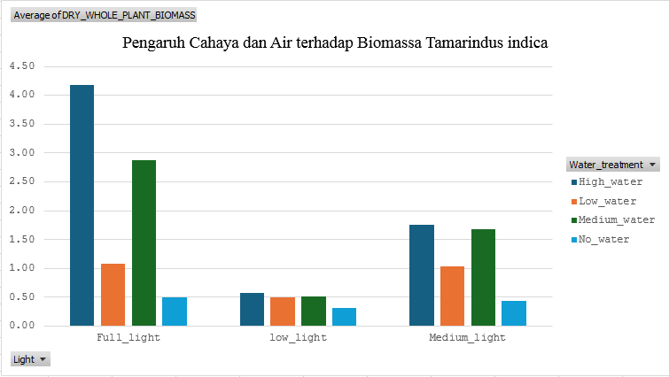
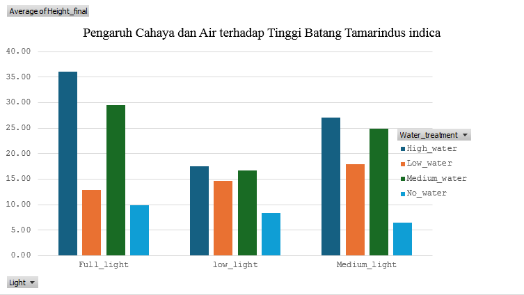
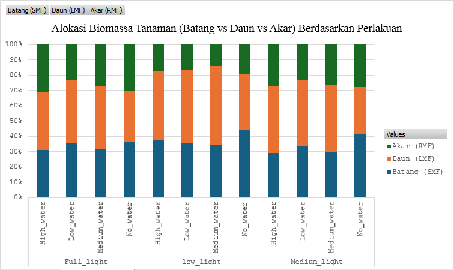

# 🌿 End-to-End Data Analytics: Combined Effects of Light and Water on Tamarindus indica Growth

## 📌 Project Overview
Proyek *Data Analytics* ini menganalisis respons pertumbuhan awal dan alokasi biomassa bibit asam jawa (*Tamarindus indica*) berdasarkan variasi pencahayaan (*Full light*, *Medium light*, *Low light*) dan ketersediaan air (*High water*, *Medium water*, *Low water*, *No water*).

Dataset berasal dari penelitian terpublikasi di repositori **Dryad**.

---

## 🛠️ Data Pipeline & Methodology
1. **Data Cleaning & Standardization:** Menyelaraskan konsistensi penulisan kategori variabel perlakuan dan penanganan nilai kosong (*missing values*).
2. **Data Dictionary:** Dokumentasi struktur data dan tipe variabel.
3. **Exploratory Data Analysis (EDA):** Agregasi data menggunakan Pivot Table dan PivotChart untuk melihat tren respons perlakuan.
4. **Inferential Statistics:** Uji Hipotesis *Two-Way ANOVA* untuk mengevaluasi signifikansi faktor tunggal dan interaksi.
5. **Correlation Analysis:** Evaluasi korelasi Pearson antar-parameter morfologi terhadap biomassa total.

---

## 📖 Data Dictionary

| Nama Kolom | Jenis Data | Keterangan Biologis |
| :--- | :--- | :--- |
| Individual | Kualitatif / ID | Identitas unik nomor sampel bibit |
| Water_treatment | Kategori (Independen) | Perlakuan Air (High_water, Medium_water, Low_water, No_water) |
| Light | Kategori (Independen) | Perlakuan Cahaya (Full_light, Medium_light, Low_light) |
| Height_final | Numerik Kontinu | Tinggi akhir tanaman (cm) |
| Diameter_final | Numerik Kontinu | Diameter batang akhir (mm) |
| Fresh_leaves_mass | Numerik Kontinu | Massa segar daun (g) |
| Dry_leaves_mass | Numerik Kontinu | Massa kering daun (g) |
| Fresh_stem_mass | Numerik Kontinu | Massa segar batang (g) |
| Dry_stem_mass | Numerik Kontinu | Massa kering batang (g) |
| Fresh_root_mass | Numerik Kontinu | Massa segar akar (g) |
| Dry_roots_mass | Numerik Kontinu | Massa kering akar (g) |
| total_aboveground_mass | Numerik Kontinu | Total biomassa bagian atas tanah (daun + batang) (g) |
| DRY_WHOLE_PLANT_BIOMASS | Numerik Kontinu (Dependen) | Biomassa Kering Total Tanaman (g) |
| SMF | Numerik Kontinu | Stem Mass Fraction (Proporsi biomassa batang) |
| LMF | Numerik Kontinu | Leaf Mass Fraction (Proporsi biomassa daun) |
| RMF | Numerik Kontinu | Root Mass Fraction (Proporsi biomassa akar) |
| RSR | Numerik Kontinu | Root-to-Shoot Ratio (Nisbah Akar-Tajuk) |
| Stomatal_density | Numerik Kontinu | Kepadatan stomata daun (per mm²) |
| FvFm | Numerik Kontinu | Efisiensi kuantum fotosistem II (Indikator stres fotosintesis) |

---

## 📊 Data Visualizations

### 1. Total Biomass Interaction (Light × Water)

### 2. Plant Stem Height Comparison (Height Final)

### 3. Biomass Allocation (Stem vs Leaf vs Root)

---

## 🔬 Statistical Results & Key Findings

### 1. Uji Signifikansi (Two-Way ANOVA)
| Faktor | Sum of Squares | df | F-Statistic | p-value | Signifikansi |
| :--- | :--- | :--- | :--- | :--- | :--- |
| **Light** | 119.91 | 2 | 105.79 | < 0.0001 | Signifikan ($p < 0.05$) |
| **Water Treatment** | 100.03 | 3 | 58.83 | < 0.0001 | Signifikan ($p < 0.05$) |
| **Interaction (Light × Water)** | 80.57 | 6 | 23.69 | < 0.0001 | Signifikan ($p < 0.05$) |

### 2. Biological Interpretation & Insights
* **Kondisi Optimum:** Pertumbuhan biomassa maksimum dicapai pada perlakuan **Full Light + High Water** (rerata **4.18 g**).
* **Limiting Factor (Cahaya):** Pada kondisi naungan lebat (*Low light*), penambahan air tidak memberikan dampak signifikan terhadap peningkatan biomassa (hanya berkisar **0.50 g – 0.58 g**). Cahaya terbukti menjadi faktor pembatas utama bagi efisiensi fotosintesis bibit *T. indica*.
* **Alokasi Organ & Stres Naungan:** Pada pencahayaan penuh (*Full light*), bibit mengalokasikan **~30.6%** energi ke akar. Namun pada naungan lebat (*Low light*), alokasi ke akar tertekan drastis hingga **14.1% - 17.2%** karena bibit memprioritaskan pembentukan daun dan tinggi batang (*etiolasi*) untuk mencari cahaya.
* **Drought Sensitivity:** Pada *Full Light*, krisis air (*No water*) menurunkan biomassa total hingga **88%** dibanding pasokan air optimal.

---

## 💡 Practical Recommendations for Forest Restoration & Nursery
* **Manajemen Pembibitan (*Nursery*):** Bibit *Tamarindus indica* wajib ditempatkan di area pendedahan cahaya penuh (*Full light*) dengan penyiraman rutin (*High/Medium water*).
* **Restorasi Lahan Kritis:** Saat transplantasi ke lahan terbuka, penanaman harus dikombinasikan dengan teknik konservasi air tanah (seperti penggunaan mulsa atau irigasi tetes) guna mencegah kegagalan pertumbuhan akibat stres kekeringan.
